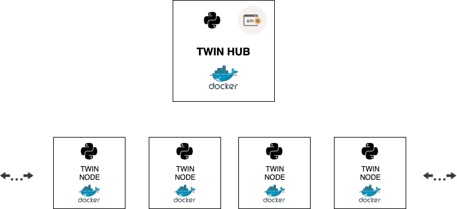

# Repository under construction

## Data Twin

### Introduction

Data Twin is a pet project to show python distributed capabilities for
data processing using docker low level API to leverage docker capabilities
and exploit the full potential of python.

### Architecture (POC)




### License

```
Licensed under GNU GENERAL PUBLIC LICENSE Version 3, 29 June 2007.
Please refer to LICENSE file in the repository root to get more details
about the liability related with using and distribution of this software.
```
